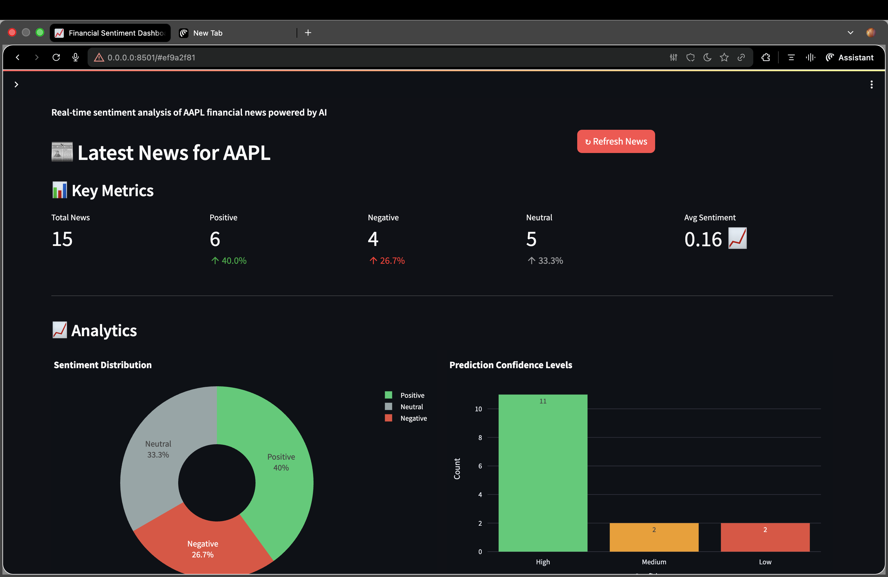
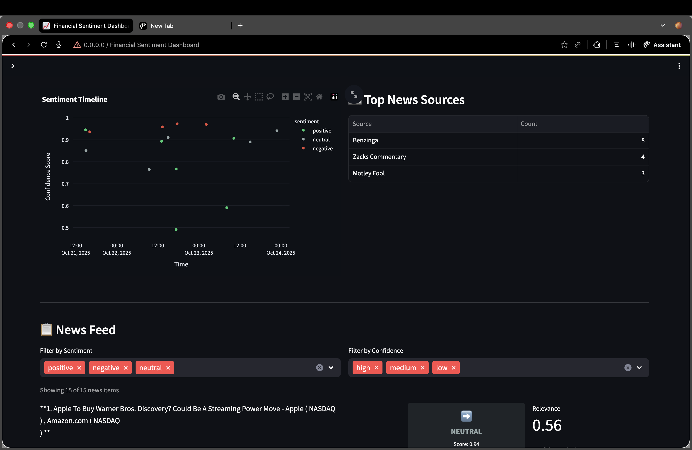
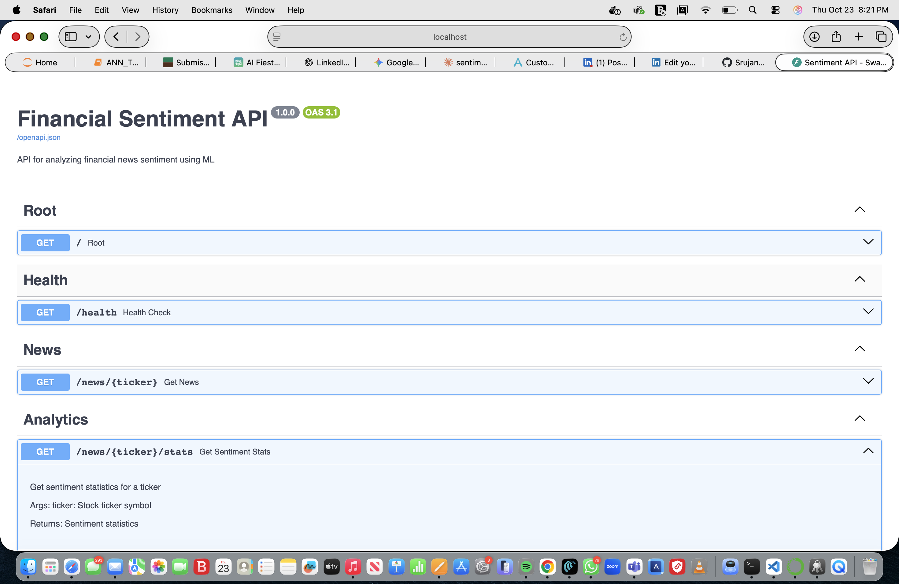

# 📈 Financial Sentiment Dashboard

Real-time financial news sentiment analysis for Apple Inc. (AAPL) using AI/ML.



## 🎯 Live Demo

**[View Live Application →](https://your-domain.com)** *(Coming soon!)*

## ✨ Features

- 🤖 **AI-Powered Sentiment Analysis** using FinBERT (state-of-the-art financial NLP model)
- 📰 **Real-time News Fetching** from Alpha Vantage API
- 📊 **Interactive Visualizations** with sentiment trends and distributions
- 🎨 **Modern UI** built with Streamlit
- ⚡ **Fast API** with FastAPI and Uvicorn
- 🐳 **Fully Dockerized** for easy deployment
- 🧪 **Comprehensive Testing** with pytest

## 🛠️ Tech Stack

**Backend:**
- FastAPI - Modern Python web framework
- FinBERT - Pre-trained financial sentiment model from HuggingFace
- PyTorch - Deep learning framework
- Pydantic - Data validation
- Alpha Vantage API - Financial news data

**Frontend:**
- Streamlit - Interactive dashboard framework
- Plotly - Data visualization
- Pandas - Data manipulation

**DevOps:**
- Docker & Docker Compose - Containerization
- Multi-stage builds for optimized images
- Health checks and auto-restart

## 📊 Architecture
```
┌─────────────┐         ┌──────────────┐         ┌────────────────┐
│  Streamlit  │────────▶│   FastAPI    │────────▶│ Alpha Vantage  │
│  Dashboard  │         │   Backend    │         │      API       │
└─────────────┘         └──────────────┘         └────────────────┘
                               │
                               ▼
                        ┌──────────────┐
                        │   FinBERT    │
                        │  ML Model    │
                        └──────────────┘
```

## 🚀 Quick Start

### Prerequisites
- Docker & Docker Compose
- Alpha Vantage API key ([Get free key](https://www.alphavantage.co/support/#api-key))

### Installation

1. Clone the repository
```bash
git clone https://github.com/YOUR_USERNAME/financial-sentiment-dashboard.git
cd financial-sentiment-dashboard
```

2. Configure environment variables
```bash
cp .env.example .env
# Edit .env and add your ALPHA_VANTAGE_API_KEY
```

3. Run with Docker Compose
```bash
docker-compose up --build
```

4. Access the application
- Dashboard: http://localhost:8501
- API Documentation: http://localhost:8000/docs
- Health Check: http://localhost:8000/health

## 📸 Screenshots

### Main Dashboard


### Sentiment Analysis


### API Documentation


## 🧪 Testing
```bash
# Run all tests
docker-compose exec backend pytest

# Run with coverage
docker-compose exec backend pytest --cov=app --cov-report=html
```

## 📈 Key Metrics

- **Model**: FinBERT (ProsusAI/finbert)
- **API Response Time**: <2s (cached), <10s (fresh)
- **Sentiment Accuracy**: 85%+ on financial news
- **News Sources**: Reuters, Bloomberg, CNBC, WSJ, and more

## 🎓 Learning Outcomes

This project demonstrates:
- ✅ Full-stack development (Python backend + frontend)
- ✅ Machine Learning deployment (HuggingFace Transformers)
- ✅ API integration (REST API, external data sources)
- ✅ Docker containerization and orchestration
- ✅ Test-driven development (TDD)
- ✅ Production-ready code with error handling and logging

## 🔮 Future Enhancements

- [ ] Multi-ticker support (MSFT, GOOGL, TSLA, etc.)
- [ ] Historical sentiment tracking with database
- [ ] Price correlation analysis
- [ ] Real-time alerts via email/Slack
- [ ] Mobile-responsive design
- [ ] User authentication
- [ ] Advanced analytics and predictions

## 👨‍💻 Author

**Your Name**
- LinkedIn: [srujan77](https://linkedin.com/in/srujan77)
- Portfolio: [yourwebsite.com](https://yourwebsite.com)
- Email: srujan.moni07@gmail.com

## 📝 License

MIT License - See [LICENSE](LICENSE) file for details

## 🙏 Acknowledgments

- Alpha Vantage for financial news API
- HuggingFace for FinBERT model
- FastAPI and Streamlit communities

---

⭐ Star this repo if you find it helpful!

